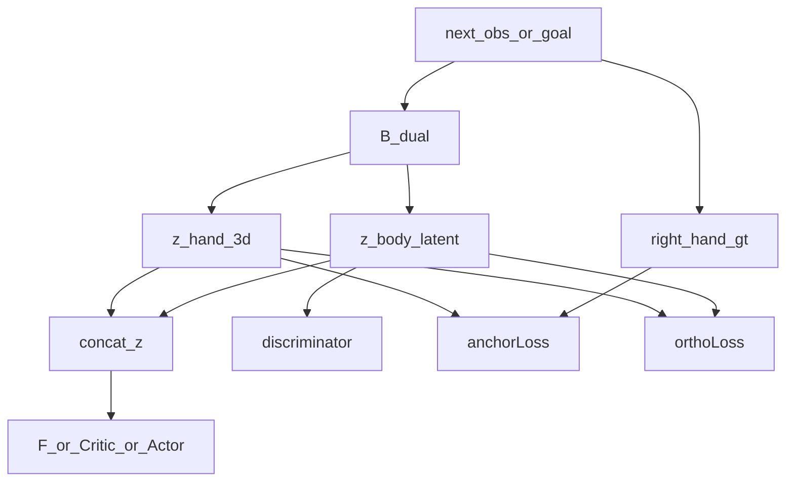

# 结构化 z 改造计划

## 目标
把当前黑盒 `z` 改造成 `z=[z_hand||z_body]`：
- `z_hand`: 3 维、显式物理语义，表示右手在 root-relative 坐标系下的位置。
- `z_body`: 保留原有 FB / CPR 的语义表示，用于步态、平衡、动作风格等高维行为因素。
- CPR 路径中，`Discriminator` 只看 `z_body`，避免把手部物理坐标重新“语义化”。

## 可行性结论
当前代码库具备实施前提：
- 环境已经提供 root-relative 刚体位置观测，可从 `max_local_self` / `local_body_pos` 这条链中提取右手位置，见 [humanoidverse/envs/legged_robot_motions/legged_robot_motions.py](humanoidverse/envs/legged_robot_motions/legged_robot_motions.py) 和 [humanoidverse/agents/envs/humanoidverse_isaac.py](humanoidverse/agents/envs/humanoidverse_isaac.py)。
- `FBModel` 当前把整个 `z` 统一球面归一化，这与物理坐标语义冲突，必须重写为“只归一化 `z_body`”，见 [humanoidverse/agents/fb/model.py](humanoidverse/agents/fb/model.py)。
- `sample_z()`、`sample_mixed_z()`、`encode_expert()` 都依赖当前“整向量黑盒 z”假设，需要联动结构化改造，见 [humanoidverse/agents/fb/agent.py](humanoidverse/agents/fb/agent.py) 和 [humanoidverse/agents/fb_cpr/agent.py](humanoidverse/agents/fb_cpr/agent.py)。

## 推荐设计
### 1. 定义结构化 z
在模型配置层引入：
- `z_hand_dim=3`
- `z_body_dim = z_dim - z_hand_dim`
- `z_hand_scale` 或工作空间边界配置

并约定：
- `z_hand` 不做整体球面归一化
- `z_body` 继续沿用 `project_z()` 的单位球投影
- 对外暴露 `split_z()` / `merge_z()` / `project_z_body()` 之类的统一接口

### 2. 改造 B 网络为双头输出
在 [humanoidverse/agents/fb/model.py](humanoidverse/agents/fb/model.py) 所依赖的网络层中新增结构化 backward：
- `B_hand(s_f)`: 从右手局部相关输入中预测 3 维右手位置
- `B_body(s_f)`: 从全局输入中预测 `z_body`
- `B(s_f) = concat(B_hand, project_z(B_body))`

注意：现有 [humanoidverse/agents/nn_filter_models.py](humanoidverse/agents/nn_filter_models.py) 不能直接复用，因为它假设的是另一种 `proprio` 输入格式；更稳妥的方式是在当前 `DictInputFilterConfig` 体系上新增“结构化输入提取器”或在 backward 内部显式切分观测。

### 3. 为 z_hand 增加显式监督
在 agent 更新中加入：
- `L_anchor = ||B_hand(s_f) - pos_hand_gt(s_f)||^2`
- `pos_hand_gt` 使用瞬时 `next_obs / goal` 对应帧，不做时间均值

工程建议：
- 监督目标优先从现有 `privileged_state=max_local_self` 中解析右手位置，避免先改环境 buffer。
- 若 `max_local_self` 的索引过于脆弱，再补一个显式 `right_hand_pos` 观测键。
- `L_anchor` 只回传到 `B_hand` 分支，不污染 `B_body`。

### 4. 加入 hand/body 解耦约束
加入软正交或去相关损失：
- `L_ortho = (B_hand^T W B_body)^2` 或等价批量交叉协方差惩罚

推荐先做低风险版本：
- 用批量 centered cross-covariance 惩罚，而不是先引入额外可学习 `Wproj`
- 先验证 `B_body` 对右手位置的可回归性是否下降，再决定是否需要更强投影矩阵

### 5. 调整 F / Actor / Critic / Discriminator 对 z 的使用方式
- `ForwardMap`、`Actor`、主 `Critic`、`AuxCritic` 继续接收完整 `z=[z_hand||z_body]`
- `Discriminator` 改为只接收 `z_body`

这是本次方案的关键取舍：
- 任务层需要知道显式手部目标，所以 `F/Actor/Critic` 应保留完整 `z`
- 风格判别器不应重新编码手部物理目标，因此只看 `z_body`

### 6. 改造 z 的采样与专家编码
在 [humanoidverse/agents/fb/model.py](humanoidverse/agents/fb/model.py)、[humanoidverse/agents/fb/agent.py](humanoidverse/agents/fb/agent.py)、[humanoidverse/agents/fb_cpr/agent.py](humanoidverse/agents/fb_cpr/agent.py) 中：
- `sample_z()` 改为分别采样 `z_hand` 与 `z_body`
- `sample_mixed_z()` 改为分别混合 hand/body 来源
- `encode_expert()` 中：
  - `z_body` 可以继续按序列做平均再投影
  - `z_hand` 按你的要求使用“瞬时 next_obs 右手位置”，不做时间平均

### 7. 修改 FB 与 CPR 损失的细节
在 [humanoidverse/agents/fb/agent.py](humanoidverse/agents/fb/agent.py)、[humanoidverse/agents/fb_cpr/agent.py](humanoidverse/agents/fb_cpr/agent.py)、[humanoidverse/agents/fb_cpr_aux/agent.py](humanoidverse/agents/fb_cpr_aux/agent.py) 中：
- 保留现有 `F·z`、Bellman、aux critic 逻辑主干
- 新增 `anchor_loss` 与 `ortho_loss_hand_body`
- `Discriminator(obs, z_body)` / `compute_reward(obs, z_body)`
- 主 critic 的 reward 仍来自判别器，但判别器内部不看 `z_hand`

需要特别检查一个副作用：
- 因为主 critic 的即时奖励只依赖 `z_body`，而 bootstrap value 依赖完整 `z`，这会形成“奖励与目标条件不完全同源”的设置。理论上可接受，但需要通过 ablation 观察是否导致 `Q_discriminator` 对 `z_hand` 过敏。

## 影响文件
优先会改这些文件：
- [humanoidverse/agents/fb/model.py](humanoidverse/agents/fb/model.py)
- [humanoidverse/agents/fb/agent.py](humanoidverse/agents/fb/agent.py)
- [humanoidverse/agents/fb_cpr/model.py](humanoidverse/agents/fb_cpr/model.py)
- [humanoidverse/agents/fb_cpr/agent.py](humanoidverse/agents/fb_cpr/agent.py)
- [humanoidverse/agents/fb_cpr_aux/model.py](humanoidverse/agents/fb_cpr_aux/model.py)
- [humanoidverse/agents/fb_cpr_aux/agent.py](humanoidverse/agents/fb_cpr_aux/agent.py)
- [humanoidverse/agents/nn_models.py](humanoidverse/agents/nn_models.py)
- 视右手监督提取方式而定，可能补充：
  - [humanoidverse/agents/envs/humanoidverse_isaac.py](humanoidverse/agents/envs/humanoidverse_isaac.py)
  - [humanoidverse/train.py](humanoidverse/train.py)

## 分阶段实施建议
### Phase 1: 最小可运行版
- 先不改环境观测协议
- 从现有 `privileged_state` 中解析右手位置
- 实现结构化 `z`、双头 `B`、`L_anchor`、`L_ortho`
- 判别器改为只看 `z_body`
- 维持现有 Actor / Critic / AuxCritic 主体结构

### Phase 2: 稳定性增强
- 如果 `privileged_state` 索引不稳定，再加显式 `right_hand_pos` 观测键
- 为 `z_hand` 加工作空间裁剪 / 归一化
- 视结果决定是否在 `ForwardMap` 对 `z_hand` 做单独升维 MLP 后再与 `z_body` 融合

### Phase 3: 验证实验
至少做三类验证：
- `z_hand` 干预实验：固定 `z_body`，扫描 `z_hand`，观察机器人是否主要移动右手
- 信息泄漏实验：从 `z_body` 回归右手位置，误差应明显高于从 `z_hand` 回归
- 训练稳定性对照：对比原版 BFM-Zero 与结构化 z 版的 tracking 指标、右手误差、姿态稳定性

## 风险与默认决策
- 风险最高点不是 `L_anchor`，而是 `z_hand` 的采样分布是否合理；若随机 hand target 大量落在不可达空间，会显著拖累 Actor。
- 默认做法应是：训练阶段 `z_hand` 优先来自真实 `goal/expert`，随机采样仅作为小比例补充，并限制在经验工作空间内。
- 若首版追求稳定性，建议先不做 6 维姿态，只做 3 维位置锚定。你已经确认采用这一路线。

## 我建议的默认实现决策
如果你确认进入编码阶段，我会按下面默认值实施：
- `z_hand_dim = 3`
- `z_body_dim = z_dim - 3`
- `z_hand` 使用瞬时 `next_obs` 的右手 root-relative 位置
- `Discriminator` 只看 `z_body`
- `F / Actor / Critic / AuxCritic` 看完整 `z`
- `z_body` 保持球面归一化，`z_hand` 单独做尺度控制
- `L_ortho` 先用简单批量去相关损失，不先引入可学习 `Wproj`
- 优先从 `privileged_state` 解析右手位置，必要时再补显式观测键